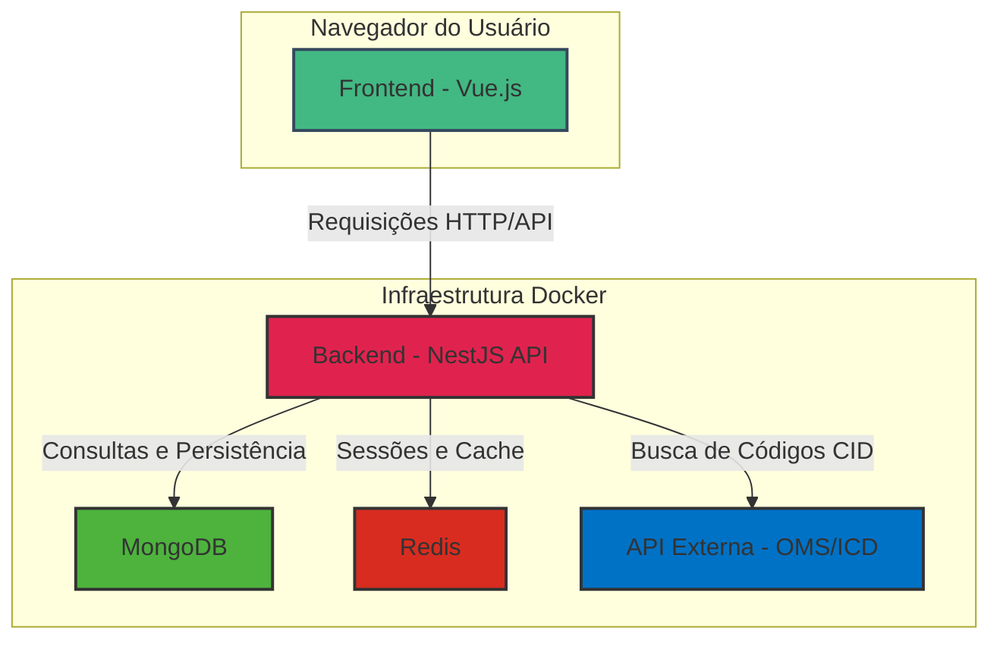

# Arquitetura do Sistema

Este documento fornece uma visão geral da arquitetura do sistema de Atestados Médicos, detalhando seus principais componentes e como eles interagem.

## Visão Geral

O sistema é construído como um monorepo contendo dois serviços principais: um **backend** (API) desenvolvido em NestJS e um **frontend** (aplicação web) desenvolvido em Vue.js. A arquitetura também inclui um banco de dados **MongoDB** para persistência de dados e um cache **Redis** para gerenciamento de sessões e outras operações de cache. O ambiente de desenvolvimento e produção é orquestrado com **Docker Compose**.

---

## Componentes Principais

### 1. Backend (API NestJS)

O backend é uma aplicação NestJS escrita em TypeScript. Ele é responsável por toda a lógica de negócios, incluindo:

-   **Autenticação e Autorização:** Gerencia o login de usuários via JWTs, com sessões armazenadas no Redis por 4 horas. Controla o acesso a rotas protegidas com base em perfis de usuário (e.g., `admin`, `hr`).
-   **Gestão de Dados (CRUD):** Fornece endpoints de API para criar, ler, atualizar e deletar os principais recursos do sistema (Colaboradores, Atestados, Usuários).
-   **Integração com a API da OMS:** Contém a lógica para se autenticar na API de Classificação Internacional de Doenças (CID) da Organização Mundial da Saúde, buscar códigos e manter um cache local dos resultados para resiliência e performance.
-   **Validação:** Utiliza `class-validator` e `class-transformer` para validar os dados de entrada nas requisições da API.
-   **Auditoria:** Mantém um log de auditoria para ações sensíveis no sistema.

### 2. Frontend (Aplicação Vue.js)

O frontend é uma Single-Page Application (SPA) construída com Vue 3, Vite, e TypeScript. Suas principais responsabilidades são:

-   **Interface do Usuário:** Renderiza todas as telas do sistema, como login, dashboard, formulários de cadastro e listagens.
-   **Gerenciamento de Estado:** Utiliza Pinia para gerenciar o estado da aplicação de forma centralizada (e.g., estado de autenticação, listas de colaboradores).
-   **Comunicação com a API:** Realiza chamadas HTTP para o backend NestJS para buscar e enviar dados. Um proxy no Vite (para desenvolvimento) e no Nginx (para produção) direciona as chamadas `/api` para o serviço de backend.
-   **Componentização:** Utiliza a biblioteca de componentes PrimeVue para construir uma interface rica e responsiva.

### 3. Banco de Dados (MongoDB)

O MongoDB é o banco de dados principal do sistema, escolhido por sua flexibilidade com documentos JSON, o que se alinha bem com os dados em TypeScript. Ele armazena as seguintes coleções principais:

-   `collaborators`: Informações dos colaboradores.
-   `users`: Contas de usuários da aplicação.
-   `medicalcertificates`: Registros dos atestados médicos.
-   `icdcodes`: Um cache local dos códigos CID obtidos da API da OMS.
-   `auditlogs`: Logs de auditoria.

O Mongoose é utilizado no backend para modelagem e comunicação com o MongoDB. Índices são aplicados em campos-chave para otimizar as consultas.

### 4. Cache (Redis)

O Redis é utilizado para fins de cache e gerenciamento de sessões:

-   **Sessões de Usuário:** Armazena dados de sessão associados aos JWTs, permitindo o logout e o controle de sessões ativas.
-   **Rate Limiting:** Ajuda a controlar o número de requisições que um cliente pode fazer em um determinado período de tempo.
-   **Cache de API:** Pode ser usado para armazenar em cache respostas de APIs externas (como a da OMS) ou consultas frequentes ao banco de dados.

---

## Fluxo de Dados

Um fluxo de requisição típico, como a criação de um novo atestado, segue os seguintes passos:

1.  O usuário preenche o formulário no **Frontend** Vue.js.
2.  Ao digitar no campo de CID, o frontend faz uma chamada para o endpoint `/api/icd/search` no **Backend**.
3.  O backend consulta seu cache local (ou a API da **OMS**) e retorna uma lista de sugestões de CID.
4.  Após o preenchimento do formulário, o frontend envia uma requisição `POST` para `/api/medical-certificates` com os dados do atestado.
5.  O **Backend** valida os dados, processa a lógica de negócios e salva o novo atestado no **MongoDB**.
6.  O backend retorna uma resposta de sucesso, e o **Frontend** atualiza a interface para o usuário.
